# Autodl云服务器本地vscode、cursor连接

### Autodl云服务器网址：
>https://www.autodl.com/home
### 租用实例后开机找到SSH登陆指令和密码

  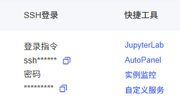

 

## Vscode控制云服务器

### 1.下载remote SSH：

  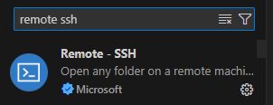

 

### 2.输入ssh登陆指令

  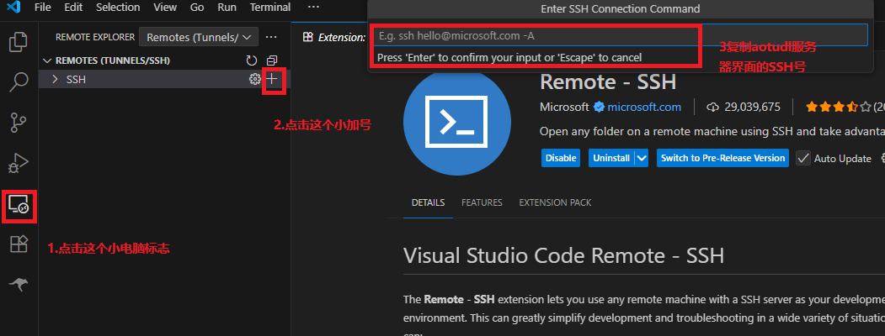

 

### 3.选择第一个选项或摁回车

  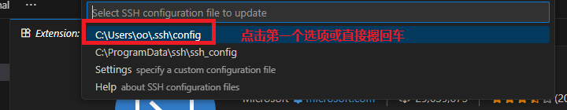

 

### 4.右下角点击connect

  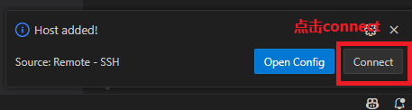

 

### 5.输入密码

  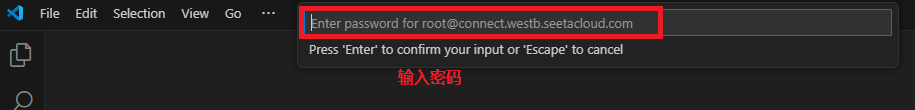

 

### 5.连接成功

  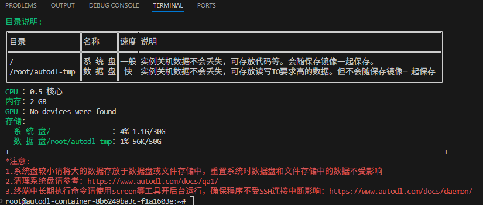

 

## Cursor控制云服务器

### 1下载remote SSH后点击这个小电脑图标

  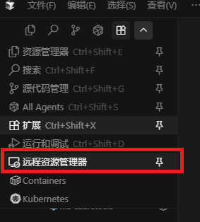

 

### 2点击左下角图标然后点上面第一个选项

  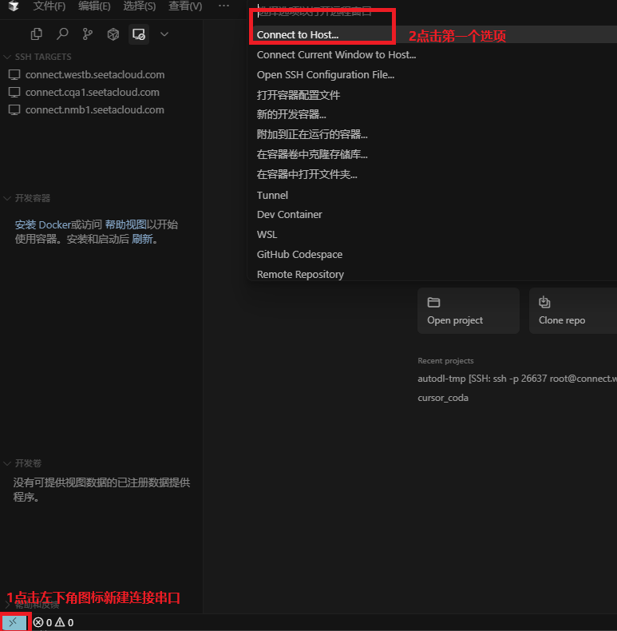

### 3输入SSH登陆指令

  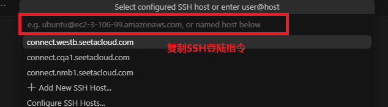

### 4输入登陆密码

  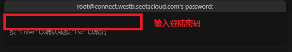

### 5连接成功

  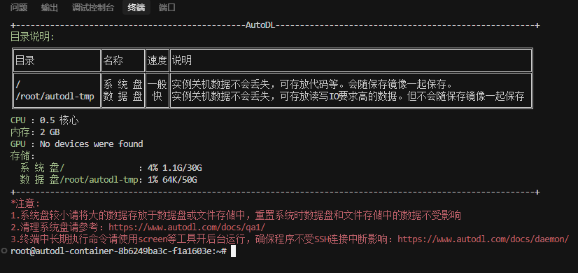

