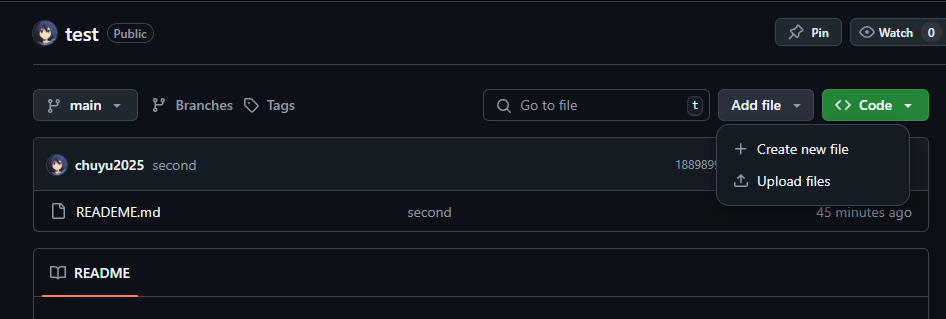
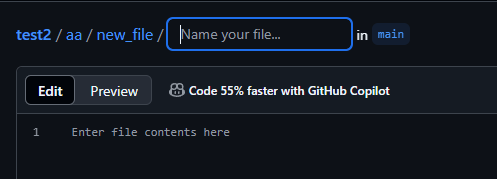
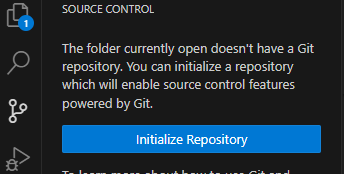
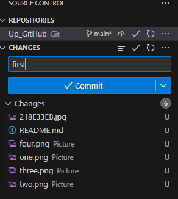
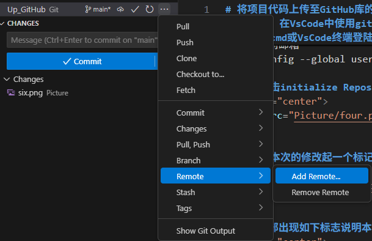

# 将项目代码上传至GitHub库的几种方法

## 步骤1：下载git
### git官网地址：https://git-scm.com/?hl=zh-cn

### 下载后使用以下命令查看是否安装成功：
>git --version

## 步骤2：GitHub创建仓库
### 加速器推荐：steam ++  
### 下载网址：
>https://steampp.net/  

### GitHub网址：
>https://github.com/

◆◆◆**注意这里最好创建的仓库是一个空白仓库**◆◆◆

## 方法1：直接在GitHub中上传项目和代码
### 1.点击：Add file  
### 点击create new file，并在文件名后打入/则会创建一个文件夹
### 点击upload files会从本地文件中选择上传

  

### 2.创建文件夹  

  

### 3.创建文件夹 

  

## 方法2：在VsCode中使用git上传项目和代码
### 1.在cmd或VsCode终端登陆GitHub用户名和邮箱  
> 登陆GitHub用户名   
> git config --global user.name "John Doe"    
> 查看当前用户名  
> git config --global user.name  
> 登陆GitHub的邮箱  
> git config --global user.email johndoe@example.com  
> 查看当前邮箱  
> git config --global user.email  

### 2.点击initialize Repository初始化仓库  

  

### 3.给本次的修改起一个标记,之后点击Commit

  

**当左下部出现如下标志说明本地初始化成功**  

  

### 3.接下来就是将项目上传到GitHub，点击add remote添加远程仓库  

  

  

**点击上部的Add remote from GitHub**

  

  

**接下来就是按照提示登陆链接GitHub账号，链接好之后顶部会出现你的GitHub仓库，选择一个你要上传到的仓库,并输入本次上传的文件的命名**

### 具体操作过程参考我的教学视频：

### 目前博主也没有涉及到很大的项目编辑，所以这两种上传项目的方式暂时已经足够我使用了，或者对于学生党来讲应该是足够的，等到以后博主不得不用到git更高阶的用法时再继续学习继续分享。  
### 今天是六一儿童节祝各位小伙伴永葆童心，学业顺利~

