# Python 安装及多版本管理、VsCode 配置、构建虚拟环境

## 下载 python 解释器

### 官网地址：

> https://www.python.org/downloads/

### 查看电脑目前有几个 python 的版本

> where python

### 查看电脑是 64 位还是 32 位

**方法一：点击设置，点击系统，在系统信息里查看电脑的系统类型**  
**方法二：在 cmd 中输入指令：wmic os get osarchitecture**

### 下载对应的 python 版本

1.选择 Add python.exe to PATH

2.选择 Customize installation

**3.★★★ 在 Advanced options 这一步，勾选 install Python for all users，并将解释器路径放到一个 c 盘没有中文路径下的一个你比较熟悉能随时想起来的路径下。**

  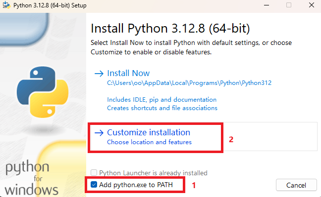

  

  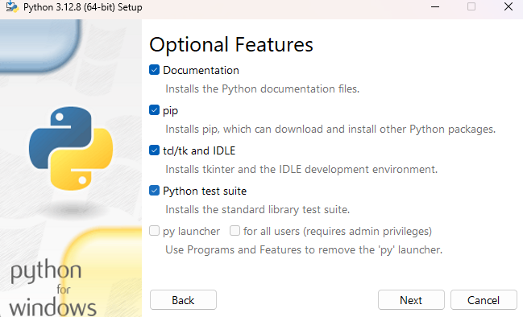

   

  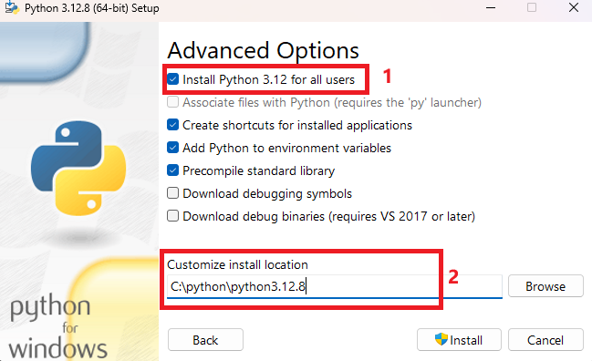

### 查看环境变量是否添加

1.点击设置，点击高级系统设置，点击环境变量；  
2.在系统环境变量中点击 path，查看刚刚下载的 python 路径是否被添加到环境变量中；  
3.在终端输入以下命令查看 python 是否安装成功：

> python --version

  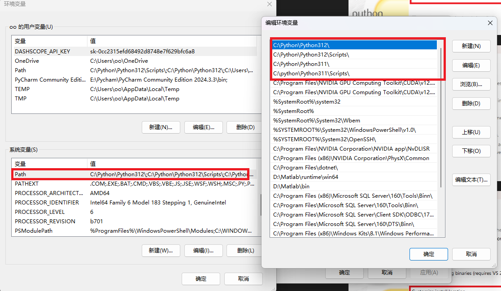

### 多个 python 的版本管理

**如果电脑存在多个版本的 python，系统默认会调用环境变量中第一个版本的 python，可以去调整它们在环境变量中的位置。**  
**或者可以将 python 解释器复制粘贴并重命名，然后调用的时候输入对应的 python 解释器名称**

> python3.12 --version

  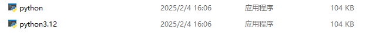

  

  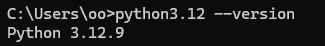

## VsCode 安装

### VsCode 官网:

> https://code.visualstudio.com/

**安装 python 插件**

  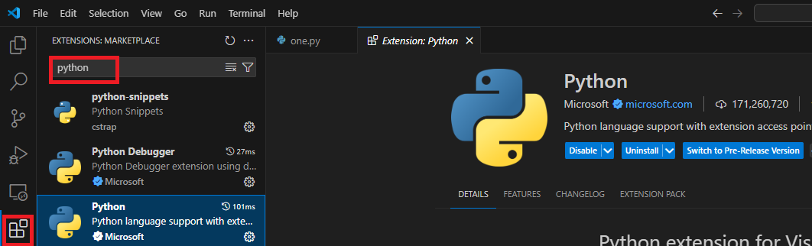

### 切换 python 解释器

  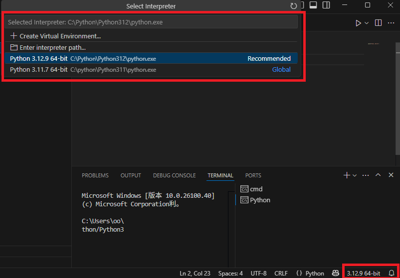

### 设置默认终端

  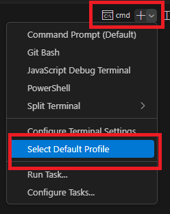

 

  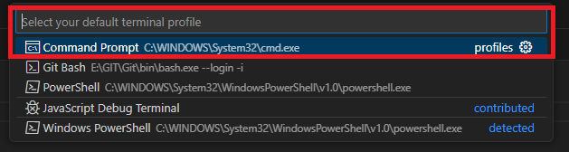

## 一些便捷式编程设置

  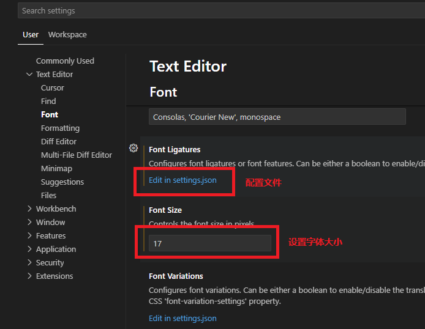

   

  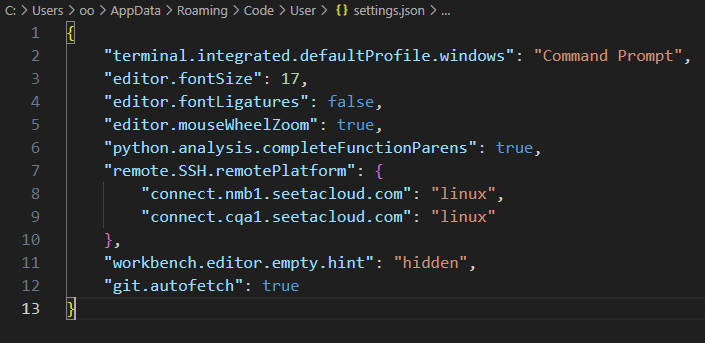

## 一些好用的 VsCode 的第三方包

### autopep8

### 自动格式化代码

  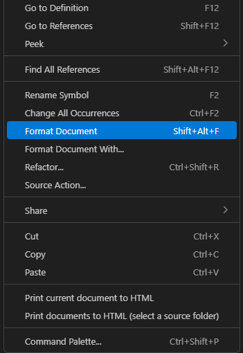

## 创建虚拟环境

### 根据自己的 python 解释器版本输入在项目地址的终端下输入以下命令

> python -m venv .venv

### 如果终端路径前没有出现(.venv)标志，说明 VS Code 中没有设置自动激活，此时可以选择手动激活，在终端输入：

> .\.venv\Scripts\activate.bat

### 在虚拟环境中下载的包会存储在.env 文件中的 site-packes 里
